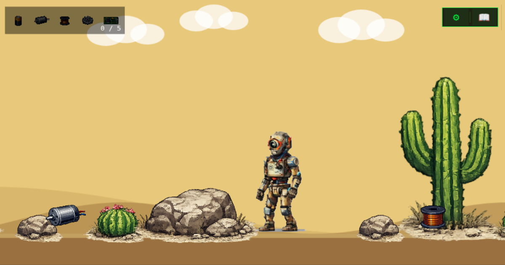

# Resource Rescue



A retro 32-bit style game based on Salvius - an open-source humanoid robot built from recycled materials.

## Levels and Gameplay

### Level 1: The Desert

A simple 2D game interface where the arrow keys can be used to make Salvius move left or right across a landscape, use the up arrow to jump over obstacles, and Shift + Right or Left arrow to run.

Salvius needs to navigate this world to find 5 parts to repair himself:

* A battery
* A motor
* A roll of wire
* A gear
* A circuit board

Once the 5 items are collected Salvius advances to Level 2.

### Level 2: The City of Scrap

Salvius must get through a junkyard (The City of Scrap), avoiding rats that will chew his wires. Salvius must get to the radio tower at the end of the city to move to level 3. Salvius has 3 lives in this round (represented as batteries) and each encounter with a rat subtracts one (encounters result in an electrical spark from the rat). Rats move back and forth between obstacles such as rocks, Salvius can jump over rats to avoid them.

### Level 3: The Radio Tower

The playing style changes from traversing a horizontal world, to a vertical one where Salvius must jump from platform to platform to get to the top of a radio tower to broadcast a message.

## Design Plan

* Music for each level
* Setting to toggle music volume (0 --> off, to 100%, default 15)

## Collaborators Welcome

Ideas consistent with the game's themes (recycling, environmental preservation, clean and renewable energy sources, etc.) are welcomed. If you have an idea for an addition or new level let's talk and work on getting it added!

## Development

A local development environment can be set up using Docker:

```bash
docker compose up -d
```

Navigate to http://localhost:5173/ to view the game.

Changes and contributions should aim to maintain:

* Support for both desktop and mobile devices
* Offline support as a progressive web app
* Accessibility features as covered in the section below

## Accessibility

The following accessibility features are implemented:

- **WASD + Space** as alternative movement keys alongside the existing arrow keys (W/Space = jump, A/D = move left/right)
- **Reduced motion**: parallax scrolling, camera shake, item bobbing, and decorative pulse/blink effects are automatically disabled when the OS `prefers-reduced-motion` setting is active. The preference can also be toggled manually in the Settings panel (gear icon, top-right)
- **Keyboard navigation in modals**: the Settings (⚙) and Manual (📖) panels support full keyboard use - Tab / Shift+Tab cycles focus between buttons, Enter or Space activates the focused button, and a visible cyan focus ring shows which item is selected. ESC closes any open panel
- **HTML semantics**: the game container carries `role="application"` and an `aria-label`; a `<noscript>` fallback message is provided

### Not yet supported

The following items were identified during an audit but are out of scope for this release:

- **Screen reader announcements** - the game renders entirely on an HTML5 canvas; Phaser provides no built-in ARIA live-region support. Meaningful screen-reader access will require a separate text-based game transcript layer
- **Gamepad / controller input** - the Web Gamepad API is not currently integrated
- **Color-blind mode** - no alternative color palette is provided; the primary HUD color (`#00FF41` green) has not been tested with common color-vision deficiency simulators
- **Large text / UI scaling** - HUD font sizes are fixed; no zoom or text-size setting exists
- **Sound captions** - sound effects have no on-screen text equivalent
- **Key remapping** - control bindings are not user-configurable
